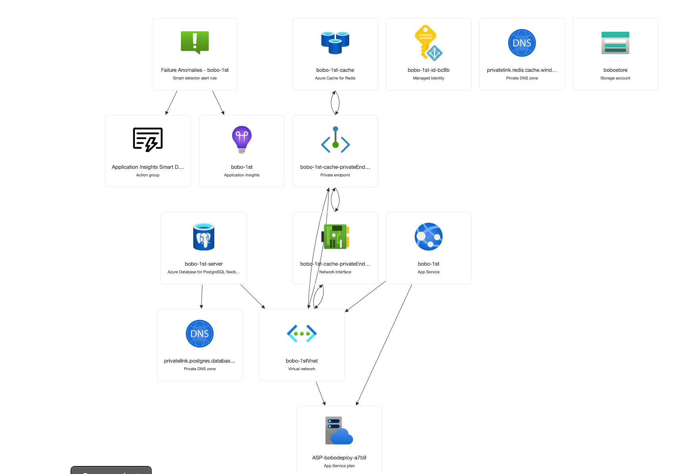

# Bobo


Landing Page @ [Bobo](https://chesahkalu.github.io/Bobo/)
Live on Azure @ [Bobo](https://bobo-1st.azurewebsites.net/accounts/signup/)

---

Bobo is a simple comprehensive web platform designed for parents to monitor and track the growth and development of their babies.
With a range of features, from logging milestones to accessing research-based expert advice and nutrition guides specific to a baby's age, Bobo is an essential tool for new parents.

Additionally, Bobo provides an interactive community platform with a forum and marketplace, where parents can discuss various topics and exchange baby items.
The platform is designed to be user-friendly, intuitive, and accessible, ensuring that parents can easily navigate and utilize the features.

Bobo was developed as a learning project to integrate every aspect of software development, from planning and design to implementation and deployment. Currently, the primary focus is on Devops principles, CI/CD, and cloud deployment with Azure.

The project is open-source, and we welcome contributions from developers interested in enhancing the platform. 
For a comprehensive documentation of the project, please refer to the google docs [link](https://drive.google.com/drive/folders/1AIiVTPoAHUFwb8M4En24w4JnKT1XB9iV?ths=true) 

---

## Table of Contents
- [Tech Stack](#tech-stack)
- [Current Features](#current-features)
- [Requirements](#requirements)
- [Setup](#setup)
- [Testing](#testing)
- [Containerization with Docker](#containerization-with-docker)
- [Continous Integration](#continous-integration)
- [Deploy To Azure](#deploy-to-azure)
- [Contribute](#contribute)
- [License](#license)
- [Authors](#authors)
---

## Tech Stack
- The application is developed with `Django`, a Python-based open-source web framework that promotes rapid development and clean, pragmatic design following the model-view-controller (MVC) architectural 
- For local development, `MySQL` is our chosen database, recognized for its reliability and robustness.
- `Bootstrap` ensures our platform is responsive and mobile-friendly, adapting seamlessly to different devices. The front-end is open to further development with `React` in the future.
- The system is containerized using `Docker`, bundling the app, its environment, and dependencies for consistent deployment.
- `Azure` is used for hosting the application and database. Leveraging Azure's app services, PostrgreSQL database, and Azure Blob Storage for media files.
- CI/CD is implemented using `Github Actions` for automated code integration, automating the building and testing of the application, and deployment. 
- `Azure` DevOps is used for project management, issue tracking, and sprint planning.
- `Azure` Monitor is used for monitoring the application and database performance.
- For further details on the tech stack, please refer to the [documentation](https://drive.google.com/drive/folders/1AIiVTPoAHUFwb8M4En24w4JnKT1XB9iV?ths=true)

---

## Current Features

### -User Authentication:
- **User Registration**: Users can create a new account providing their email and password.
- **User Login**: Users can securely log into their account using their credentials.
- **Password Hashing**: All passwords are securely hashed for storage, ensuring user privacy and security.

### -Baby Profiles:
- **Creation**: Users can create detailed profiles for their babies, including name, gender, date of birth, weight, height, parent's details and pictures.
- **Update & Deletion**: Users have the flexibility to update or delete the baby profiles.

### -Milestones, Activities, and Nutrition Guides: 
- **Milestones**: Users can log their baby's milestones, which will include the date and the description. The milestones will be displayed on the baby's profile.
- **Activities**: Users can access activities that are appropriate for their baby's age and milestone expectancy. The activities will be displayed on the baby's profile.
- **Nutrition Guides**: Users can access nutrition guides that are appropriate for their baby's age. The nutrition guides will be displayed on the baby's profile.
`Most of milestone logic have beeen integrated with very scanty data, Code adjustment might come soon to handle a largely populated milestone database`

### -Forum:
- **Categories**: Default categories will be provided to create threads and view posts. These would include general, health, nutrition, and development etc.
- **Threads**: Users can create threads in the forum, which will be displayed in the appropriate category. Threads will include a title and description.
- **Posts**: Users can create posts in the forum, which will be displayed in the appropriate thread. Posts will include a title and description.

### -Marketplace:
- **Items**: Users can create items to sell in the marketplace. Items will include a title, description, price, image and contact information.
- **Categories**: Default categories will be provided to create items and view items. These would include general, health, nutrition, and development etc.

---

## Requirements
The [requirements.txt](./requirements.txt) has the following packages, all used by a typical data-driven Django application, and also including packages for Azure deployment.
| Package | Version | Description |
| ------- | ------- | ----------- |
| [Django](https://pypi.org/project/Django/) | 3.2.4 | Core Django framework. |
| [Pillow](https://pypi.org/project/Pillow/) | 8.2.0 | Image processing library required by Django for `ImageField` and others. |
| [django-crispy-forms](https://pypi.org/project/django-crispy-forms/) | 1.11.0 | Form rendering plugin for Django, helps with rendering forms in templates. |
| [python-dateutil](https://pypi.org/project/python-dateutil/) | 2.8.1 | Provides powerful extensions to the standard datetime module. |
| [django-filter](https://pypi.org/project/django-filter/) | 2.4.0 | Filtering tool to easily filter querysets from URL parameters. |
| [djangorestframework](https://pypi.org/project/djangorestframework/) | 3.12.4 | Toolkit for building Web Restful APIs. |
| [django-environ](https://pypi.org/project/django-environ/) | 0.4.5 | Environment variables handling. |
| [django-allauth](https://pypi.org/project/django-allauth/) | 0.44.0 | Authentication app for Django that "just works". |
| [python-dotenv](https://pypi.org/project/python-dotenv/) | 0.17.0 | Reads the key-value pair from .env file and adds them to environment variable. |
| [mysqlclient](https://pypi.org/project/mysqlclient/) | 2.0.3 | MySQL client for Python. |
| [django_extensions](https://pypi.org/project/django-extensions/) | 3.2.3 | Adds some useful features for Django. |
| [psycopg2-binary](https://pypi.org/project/psycopg2-binary/) | 2.8.6 | PostgreSQL database adapter for Python. |
| [whitenoise](https://pypi.org/project/whitenoise/) | 6.6.0 | Simplified static file serving for Python web apps. |
| [django-redis](https://pypi.org/project/django-redis/) | 5.4.0 | Redis cache backend for Django. |
| [django-storages](https://pypi.org/project/django-storages/) | * | For enhanced storage options. |
| [azure-storage-blob](https://pypi.org/project/azure-storage-blob/) | * | For Azure Blob Storage integration. |

---

## Setup
To set up the project on your local machine, follow the steps below:

1. Clone the repository to your machine
`git clone https://github.com/chesahkalu/Bobo.git`

2. Navigate to the project directory:
`cd Bobo`

3. Ensure you have Python 3.9+ and pip installed. Then, set up a virtual environment and install the dependencies:
`pip3 install -r requirements.txt`

4. Set up the database
The application uses MySQL for local development. Ensure you have it installed and running. Update the DATABASES configuration in Bobo/settings.py with your MySQL credentials.
Run the following commands to integrate your database 
`python3 manage.py makemigrations`
`python3 manage.py migrate`

5. Run the application
`python3 manage.py runserver`

---

## Testing
We utilize Django's testing framework for ensuring our application's robustness. 
Our test cases for now, cover user authentication, baby model creation, and various view functionalities associated with baby profiles.
You can test the application by creating a new user, logging in, and navigating to the home page. More comprehensive tests will be added as more features are implemented.

To run the tests locally, use the following command:
`python3 manage.py test 'app'`

---

## Containerization with Docker

Containerization, powered by Docker🐳 , provides an isolated and consistent environment for our Bobo application, ensuring it runs uniformly from a developer's local environment to a production server. This section outlines the steps to set up, build, and run the Bobo application using Docker and Docker Compose.

### 🌟 Why Docker?

- **Consistency**: Say goodbye to "it works on my machine" issues.
- **Scalability**: Easily scale up services as needed.
- **Isolation**: Your application and its environment are bundled together.

### 🛠️ Setting Up with Local MySQL Server

If you're running a MySQL server locally and wish the containerized Bobo app to connect to it, update the `settings.py` in the Django application. Set the `DATABASES` configuration's `HOST` field to `host.docker.internal`. This ensures seamless communication between the containerized app and services on the host machine.

### 🔧 Building and Running without Docker Compose

1. **Building the Image**: Use the Docker CLI to build an image from the Dockerfile.
    ```bash
    docker build -t bobo_app:v1 .
    ```
2. **View Built Images**: Confirm the image was created.
    ```bash
    docker images
    ```
3. **Run a Container**: Spin up a container instance from the built image.
    ```bash
    docker run -d -p 8000:8000 bobo_app:v1
    ```
4. **Check Containers**: View all running containers.
    ```bash
    docker ps
    ```
5. **Stopping a Container**: When done, you can stop the container.
    ```bash
    docker stop [CONTAINER_ID]
    ```

### 🔄 Using Docker Compose

Docker Compose simplifies the process of managing multi-container applications. For the Bobo app, it's the magic wand that builds and runs both the Django application and its MySQL database effortlessly.

- **Start Services**: This builds (if needed) and runs the services.
    ```bash
    docker-compose up
    ```
- **Stop Services**: When done, use the following command to stop the services.
    ```bash
    docker-compose down
    ```

### 🗃️ Configuring MySQL in Docker

The initial setup of our MySQL container is steered by environment variables in `docker-compose.yml`. Once you spin up the containers, ensure that the `settings.py` in your Django app is pointing to this MySQL instance by setting the database `HOST` to `db`. To run migrations inside the container:
```bash
docker-compose exec web python manage.py migrate
```

---

## Continous Integration

Continuous Integration (CI) is a foundational pillar in DevOps, emphasizing the regular integration of code into a shared repository. Each integration can then be automatically tested and verified, ensuring that new changes don't introduce bugs. For our Bobo application, CI ensures that our codebase remains reliable, efficient, and ready for deployment at all times.

### -Why GitHub Actions?

GitHub Actions is a CI/CD tool provided directly within GitHub, enabling developers to automate tasks right within their repositories. With GitHub Actions, Bobo's codebase undergoes automated processes every time there's a change, ensuring quality and consistency.

### -Setting Up GitHub Actions

1. **Navigate to Your Repository**: Access the "Actions" tab within your GitHub repository.
2. **Workflow Creation**: Choose a predefined workflow or set up a custom workflow.
3. **YAML File Configuration**: Define your workflow using the provided YAML editor. This file dictates the actions, triggers, and jobs.
4. **Commit**: Save and commit your YAML file to the repository.
5. **Monitor**: Post-commit, GitHub Actions will execute the workflow. Monitor the progress under the "Actions" tab.

### -Bobo's CI Workflow

The `.yml` file for Bobo details our CI steps:

- **Triggers**: Activates on `push` and `pull_request` events to the master branch.
- **Jobs**: Runs on the latest Ubuntu machine.
- **Steps**:
  1. **Code Checkout**: Fetches the latest code.
  2. **Python Setup**: Initiates Python 3.9.
  3. **Dependencies**: Installs requirements via pip.
  4. **Testing**: Executes Django's testing suite.
  5. **Docker Integration**: Builds a Docker image and runs tests inside the Docker container.

---

## Deploy To Azure

Azure, Microsoft's cloud computing platform, provides a robust infrastructure for hosting applications, databases, and services. For Bobo, Azure App Services, Azure Database for PostgreSQL, and Azure Blob Storage are utilized to host the application, database, and media files, respectively. For a comprehensive guide, check Azure documentation [here](https://learn.microsoft.com/en-us/azure/app-service/tutorial-python-postgresql-app?tabs=django%2Cmac-linux&pivots=azure-portal)



### -Azure App Services
- **Web App and Database**: Search for "Web App + Database" in the Azure portal to create new resources. Choose Python 3.9 for the runtime stack, and select PostgreSQL for the database.
- **Resource Group**: Create a new group to house the resources.
- **Hosting Plan**: Start with the Basic tier, and adjust according to your needs as your application scales.

### -Configure Application Settings
In the Azure portal, under your App Service's Configuration section, verify that the auto-generated connection strings for PostgreSQL and Redis are present. These settings are crucial for the application's database interactions and caching mechanism.

### -Deploy the Application
**Configure GitHub Actions for continuous deployment**:
- Configure the [azure.py](./Bobo/azure.py) file with the PostgreSQL and Redis connection strings, enable the [settings.py](./Bobo/settings.py) to use the azure.py file in production.
- Navigate to the "Deployment Center" in your App Service.
- Select GitHub as the source and configure the build provider with your repository details.
- Save to commit a workflow file to your repository, enabling automatic deployment on git push events.
- A workflow file will be created in the `.github/workflows` directory, detailing the deployment steps.

### -Verify Connectivity and Run Migrations
Ensure your application can connect to the database and cache services:

- Use the SSH feature in App Service to open a terminal session.
- Run python manage.py migrate to apply database migrations.

### -Blob Storage for Media Files
Azure Blob Storage is a cost-effective solution for storing media files, such as images and videos. To integrate Blob Storage with Bobo:

- Create a new Blob Storage account in the Azure portal.
- Generate a new container for storing media files.
- Create and add blob storage as a service connector to your App Service in the Azure portal.
- Update the [azure.py](./Bobo/azure.py) file with the Blob Storage credentials.

### -Monitor Application Performance
Azure Monitor provides insights into your application's performance, health, and usage. Use Azure Monitor to track metrics, set up alerts, and monitor the application's overall health.

### -Scaling and Load Balancing
Azure App Services offer scalable options to handle increased traffic and load. Configure auto-scaling rules and load balancing to ensure your application remains performant and responsive.

---

## Contribute

We're on the lookout for enthusiastic contributors like you! 🌟

### -Found a Bug or Have a Feature Idea?
- Open an issue and tell us all about it.

### -Ready to Code?
- Fork the repo, make your updates, and submit a pull request.
- Ensure all tests pass before submitting by running `python3 manage.py test`.

### -Frontend Contributors Needed!
- If you're skilled in modern frontend frameworks, we need you to bring our API to life with a stunning UI.
- Check out the [API docs](https://docs.google.com/document/d/1kkgUIu-6aiNDWcKMP4yipJjBpSj5-0eSxkqD8QwJMjs/edit) and let your creativity flow!

---

## License
This project is licensed under the Apache License 2.0. For more information, please refer to the [LICENSE](LICENSE) file.
This README is subject to updates as the application evolves, so be sure to check back for the latest information.

---

## Authors
[Chesachi Kalu](https://chesahkalu.github.io/my_resume/)

## <h3 align="center"> © Bobo 2023. All rights reserved. <h3/>